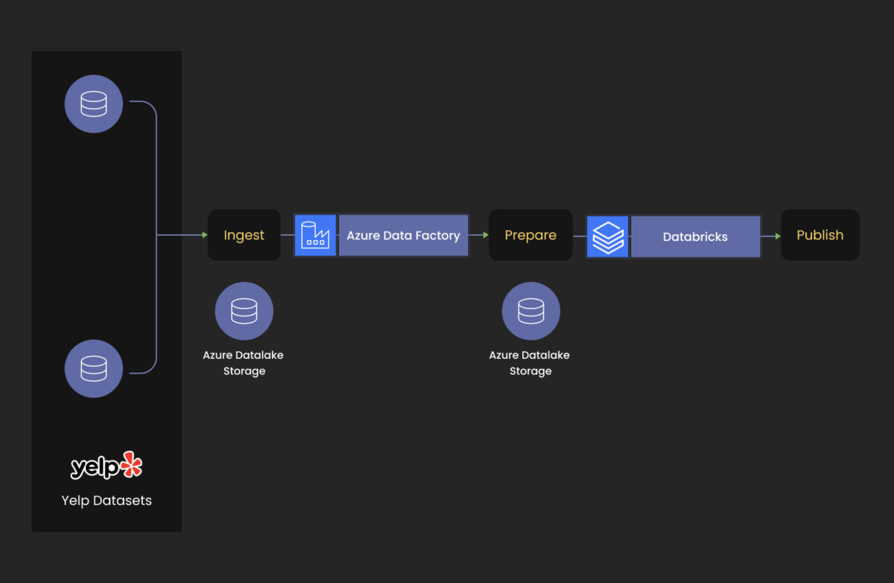

# Analyze Yelp Dataset with Spark & Parquet format on Azure Databricks

## About yelp and the dataset
Yelp is a community review site and an American multinational firm based in San Francisco, California. It publishes crowd-sourced reviews of local businesses as well as the online reservation service Yelp Reservations. Yelp has made a portion of their data available in order to launch a new activity called the Yelp Dataset Challenge, which allows anyone to do research or analysis to find what insights are buried in their data. Due to the bulk of the data, this project only selects a subset of Yelp data in a zip file named 'dataset.zip,' which comprises three JSON files, including 'business.json', which provides business data such as location data, attributes, and categories.

## Tech stack
- Python3
- Services: 
  - Azure Datafactory
  - Azure Datalake Storage Gen2
  - Azure Databricks

## Architecture

